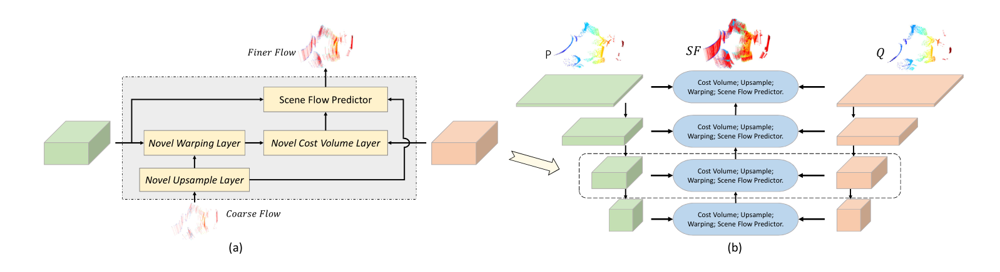

# 《PointPWC-Net: Cost Volume on Point Clouds for (Self-)Supervised Scene Flow Estimation》阅读笔记

## Abstract

​	提出了cost volume，这是一个包含两帧点匹配代价的三维张量和一种金字塔型结构的网络，从粗流到细流。

​    文章计算cost volume的方法区别于传统方法(传统方法：需要在高维的空间彻底计算每两对应的cost volume)，文章方法：直接对输入点云进行PointConv（点云卷积）操作

## 网络结构

