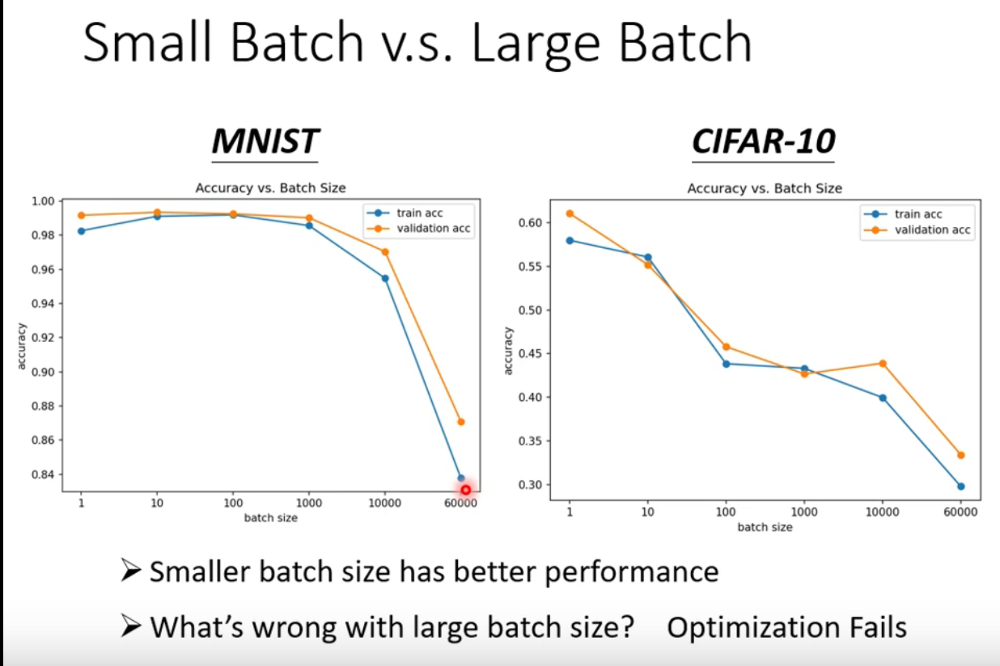
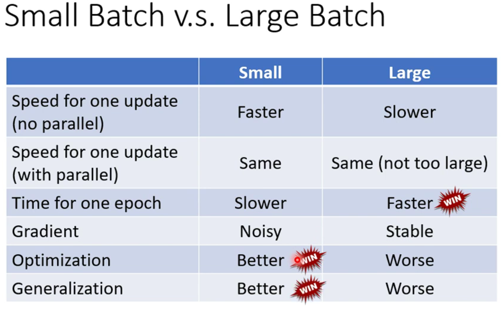
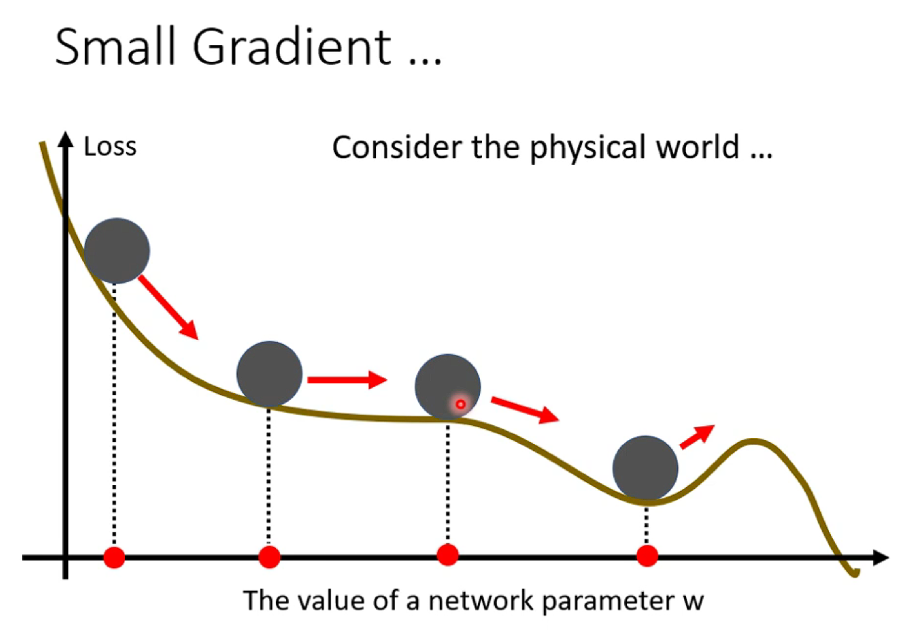
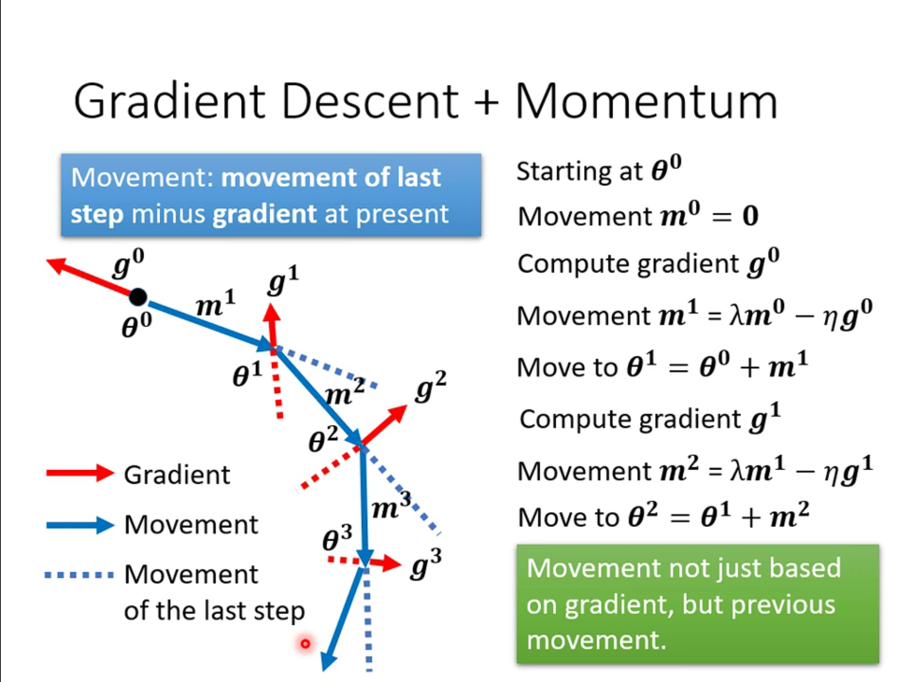
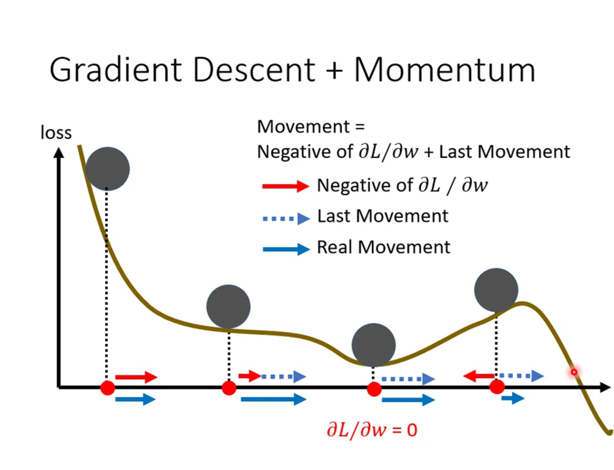
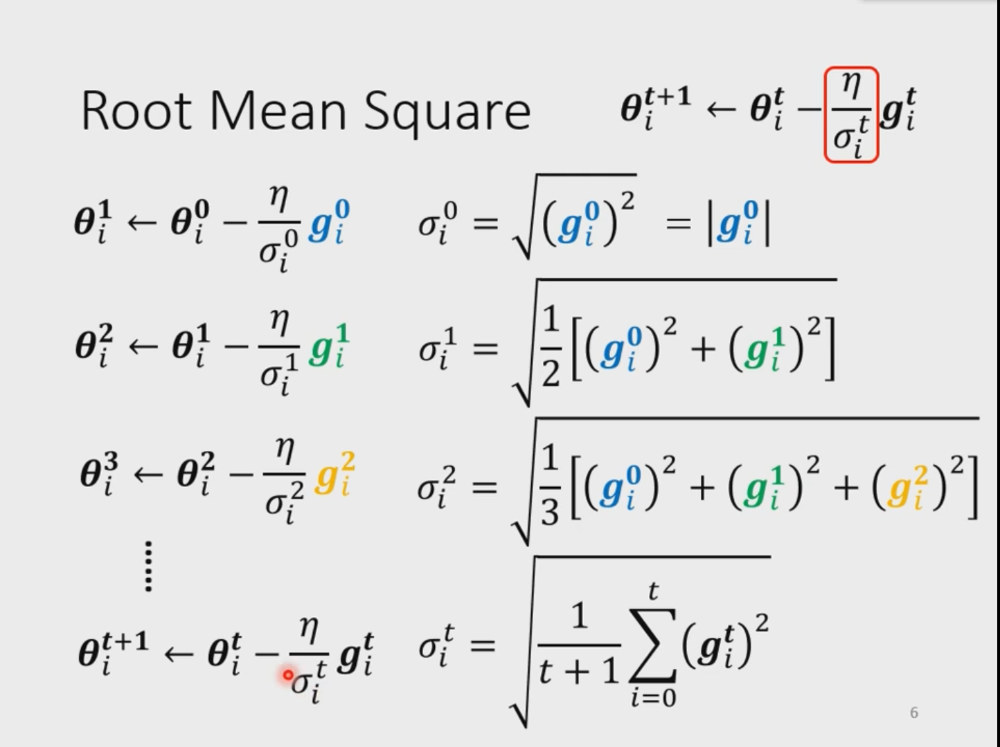
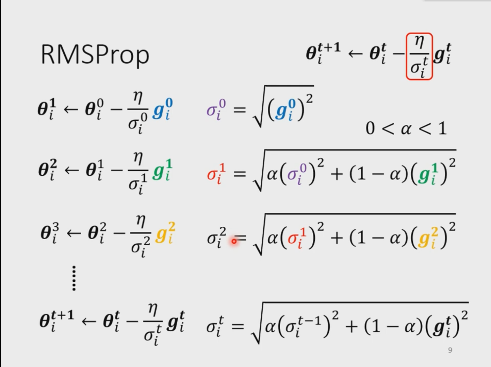
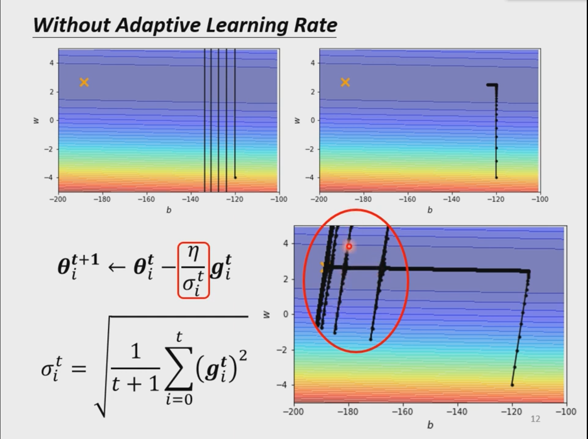
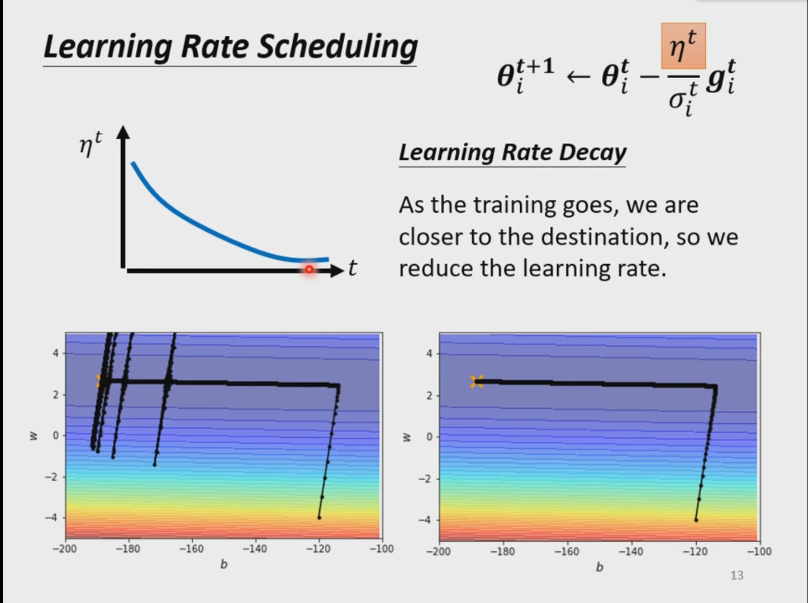

基础知识要点

## batch和momentum

small batchsize和large batchsize在一定的范围内的耗时是一样的

small batchsize的性能比large batchsize好，可能的原因是batchsize越小意味着更新loss约频繁，每个batchsize的loss又可能又差别，这样就不容易在local minima 或者鞍点停止

momentum---是一种优化方式，参考了物理世界动量的概念

在现实世界中，就算一个小球滚到了鞍点或者local minima它也会因为其动量而继续运动

momentum是和gradient 一起的

在进行梯度下降时，需要考虑上一次的更新方向，即momentum,这一次更新就为gradient+momentum

直观理解

## Adaptive learning rate(自动调整学习率)

Root Mean Square:相当于在原来的学习率n上除以一个可变参数，这个参数就是之前梯度的mean square

RMSProp:考虑到了上一个sigma对于这一次的学习率的影响，所以在学习率的调整上效果更好

Adam = RMSProp +momentum

采用Root Mean Square 时仍然会出现问题：

因为累计的sigma会越来越小，所以会有一个爆发，但是仍然可以调整回来。优化他的方法是：

​	让固定的n变成随时间变化而变小

