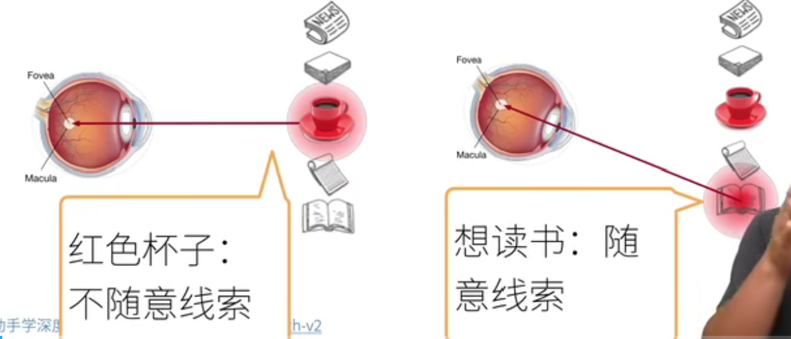
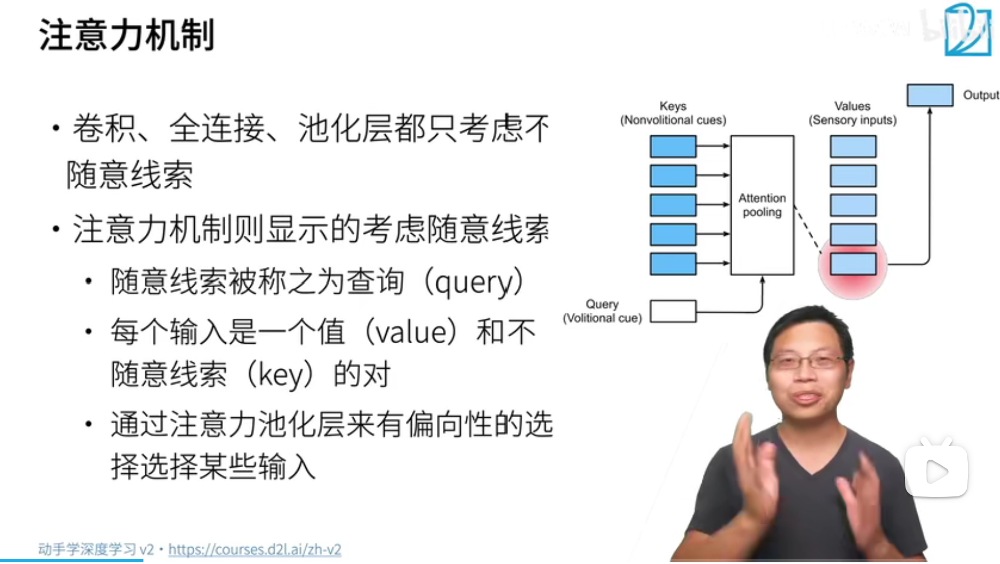
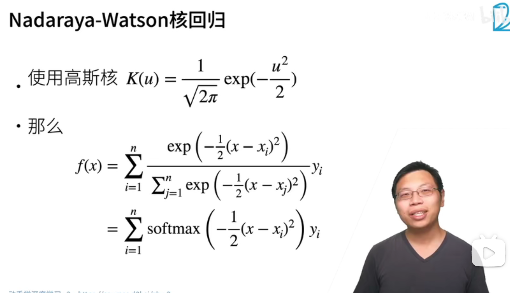
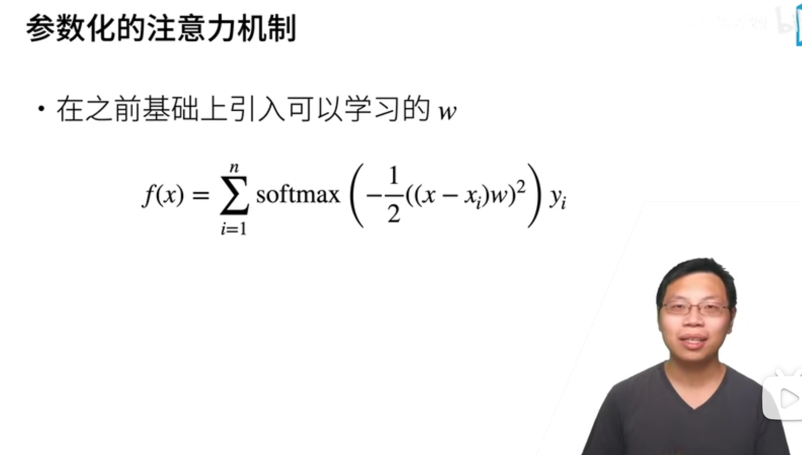
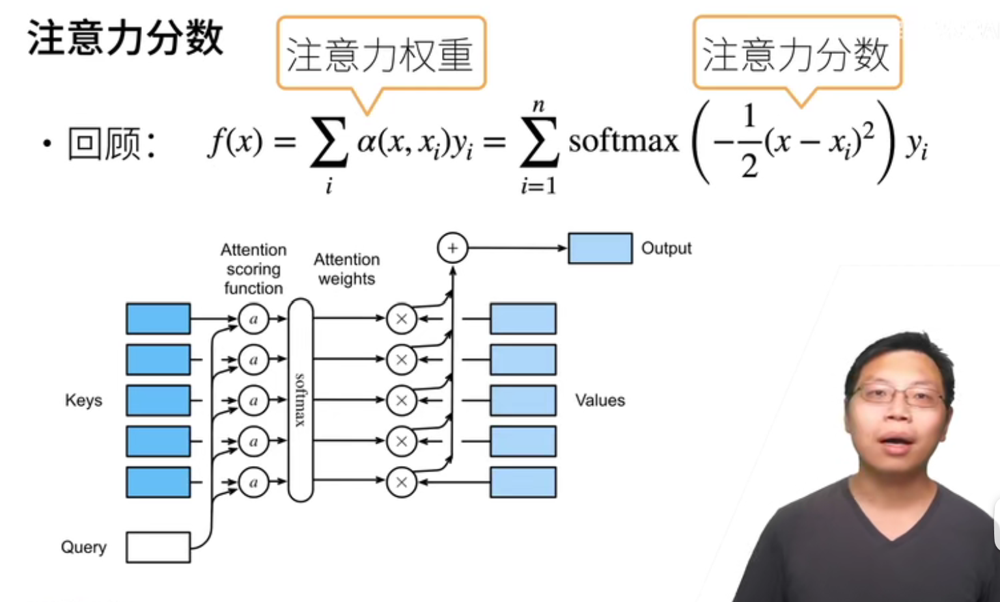
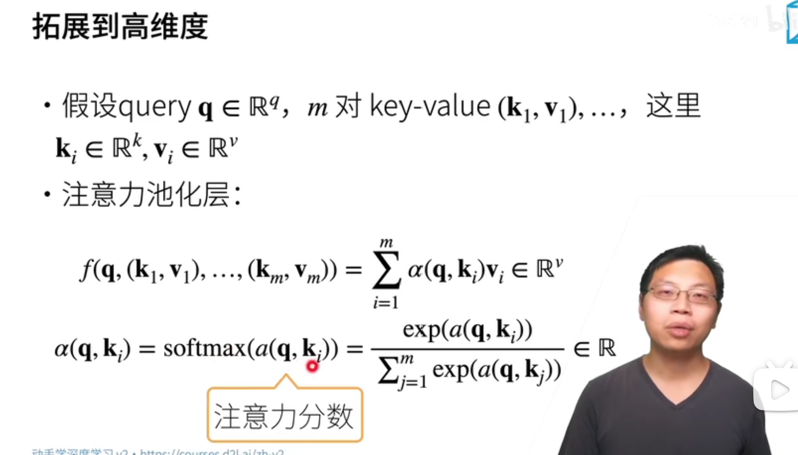
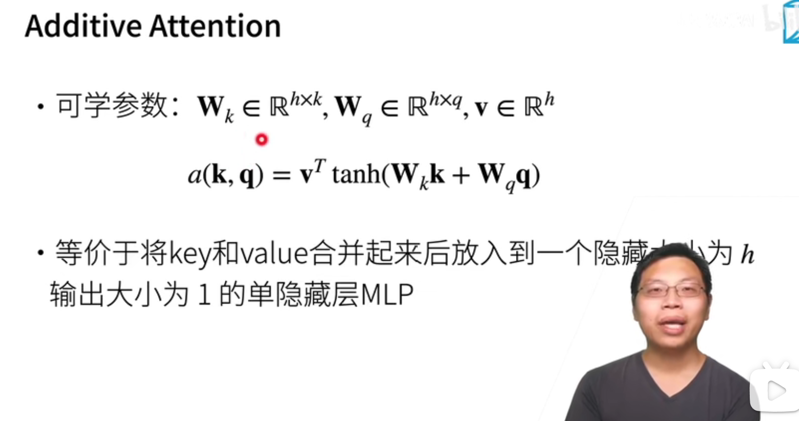
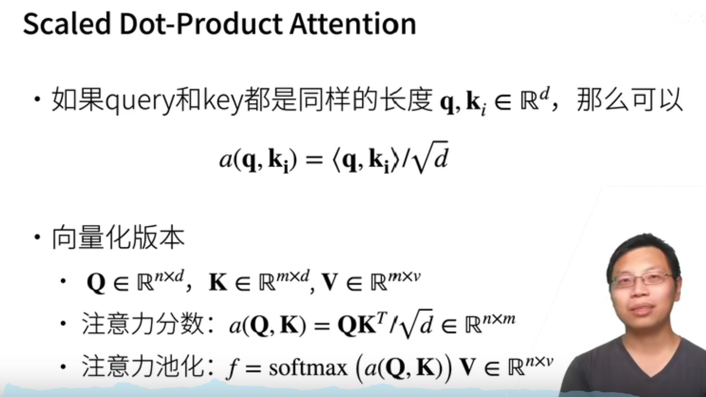
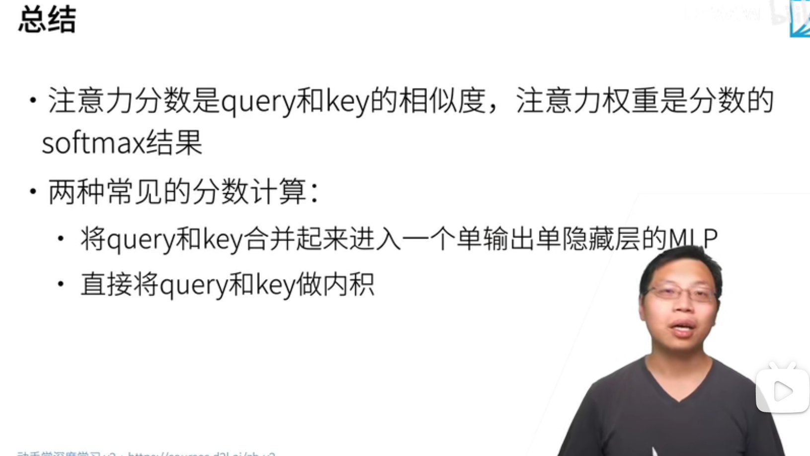

# 注意力机制

## Query and Key

Query :随意线索

Key:不随意线索

## 机制

## 非参数注意力（不可学习）

## 

## 参数化注意力机制（可学习）

## little summary

注意力机制中，通过query（随意线索）和key（不随意线索）来有偏向性的选择输入

以上描述的方法是对于单个量，如果拓展到高维向量怎么做呢，请看下面

## 注意力分数

方法一：有参数

很好理解，就是将q和k合并起来放在全连接层，1层,h个输入，1个输出

方法二：无参数

## little summary

